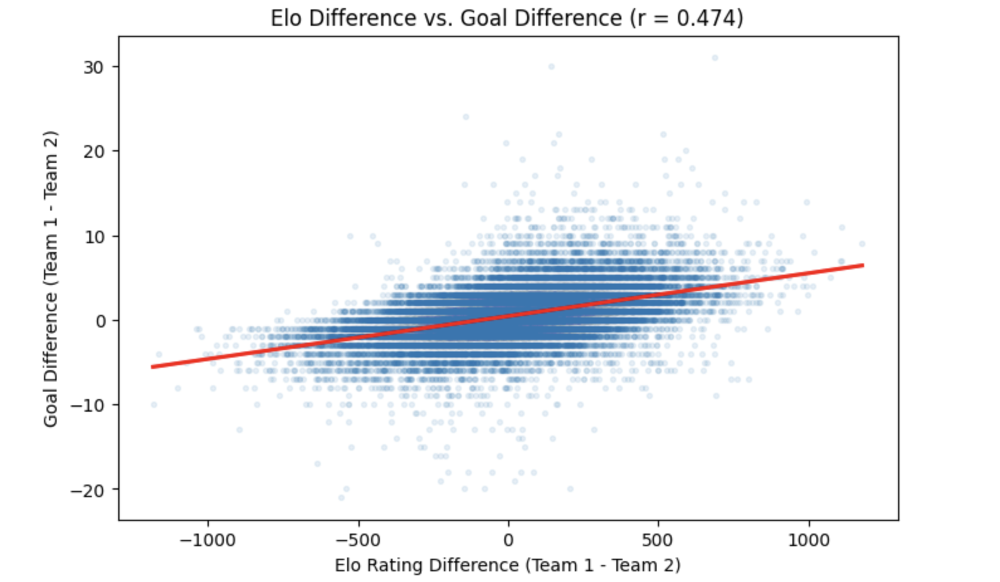

# TheFifaProphecy

Contributors:\
Donya Ahmadi \
Vayu Sarangam

## World Cup Prediction Markets: From Regression to Portfolio

A class project from my applied analytics program (AAN515) exploring how
statistical models translate into decisions under uncertainty, using
international football and prediction markets as the testbed.

## What it does

1. **Elo validation.** Verifies that Elo rating difference correlates with
   actual goal difference across 40,000+ historical international matches
   (Pearson correlation with a fitted regression line).
2. **OLS margin model.** A linear regression predicts expected goal
   difference, then maps that continuous prediction to Win/Draw/Loss
   probabilities using the normal CDF with the validation RMSE as sigma.
3. **Logistic regression.** Models win probability directly. Coefficients
   are interpreted as odds ratios, and a Bayesian log-odds update shows how
   an Elo advantage shifts a prior win probability.
4. **Kelly portfolio.** Compares model probabilities against Polymarket
   prices for World Cup outright winners and sizes a hypothetical $10,000
   portfolio using Half-Kelly allocation, buying No contracts where the
   market overprices a team.

## Key takeaways

- The model never needs to pick winners, only to find gaps between its
  probabilities and market prices. The largest position was a No contract
  on an overpriced favorite.
- Benchmarked against the betting market, the market won on every metric
  (log loss, Brier score, RPS, accuracy). Edges are small and hard to find.
- For the Spain vs Argentina final, the model calls a near coin flip with
  a slim edge to Spain.

## Files

- `predict_final.py` - standalone script computing the final's probabilities
- `elo_vs_goal_diff.png` - Elo difference vs goal difference across 40k+ matches

## Data

Match data and pre-trained models were provided as course materials and
are not included in this repo.
